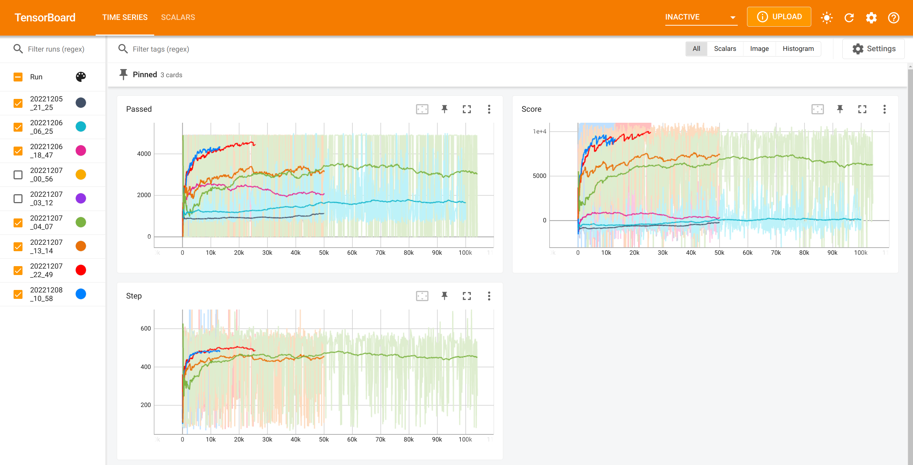
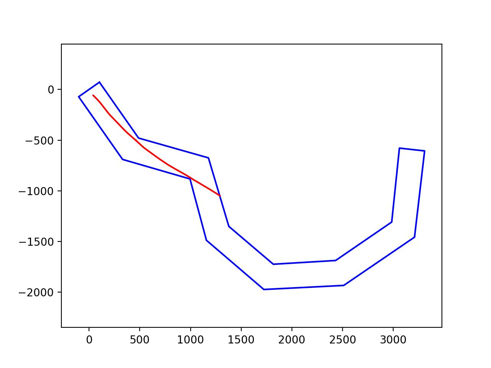
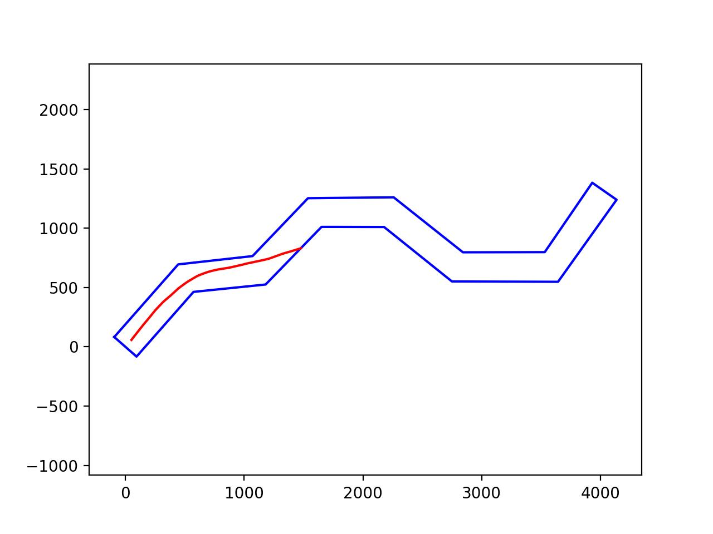
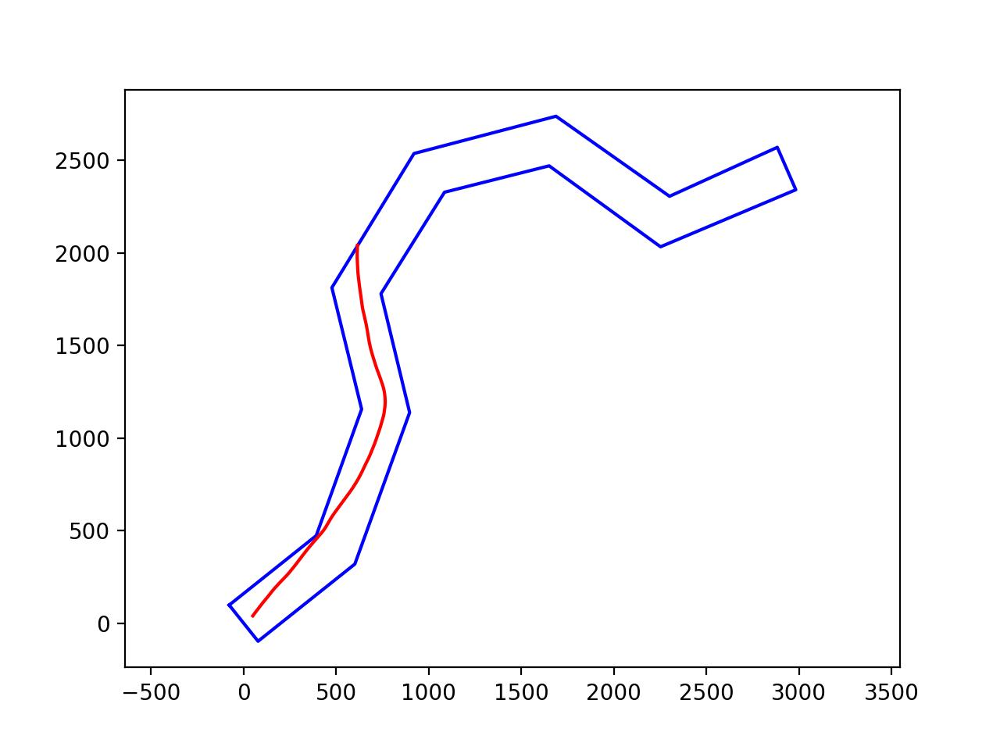
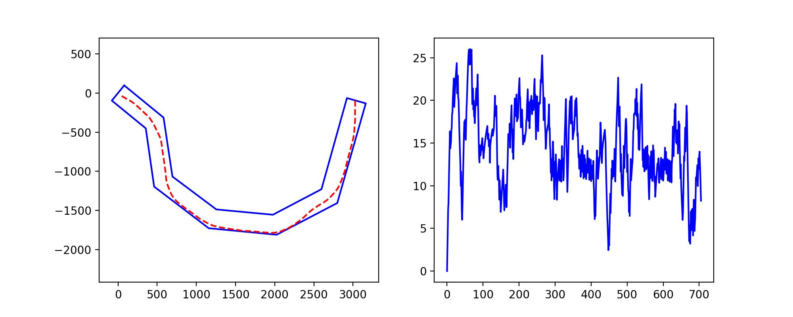
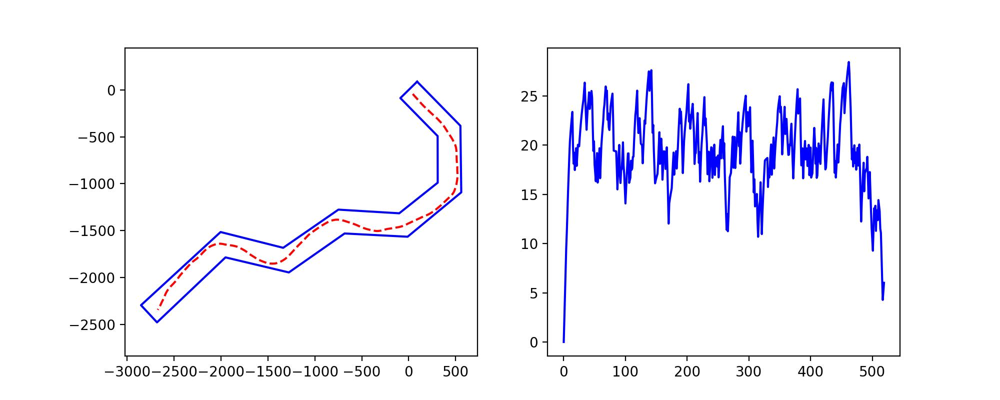

# Q-Learning-Car-with-a-Well-Built-Environment

一个通过Matplotlib和Numpy实现计算几何构建环境的QLN小车。截至目前，小车已经进行了大约30万次实验。

实验是分次进行的，这样可以重置epsilon，让其随机、广泛、充分的尝试破镜之道，并微调奖励/惩罚机制，（我的想法是为了避免其摆烂或者目光过于短浅），当然更重要的原因我没有那么多时间。。。

A QLN car with the environment built by implementing computational geometry of numpy and matplotlib. As of now, the car has performed about 300,000 experiments.

The experiment is carried out in batches, so that epsilon can be reset, allowing it to randomly, widely, and fully try the way of breaking the mirror, and fine-tune the reward/punishment mechanism, (my idea is to prevent it from being bad or too short-sighted), Of course, the purpose of restarting multiple times is because I don't have that much time...

# 快速上手 Quick Strat

为了快速了解项目，了解模型、环境、约束等等条件，您应该从[environment.ipynb](environment.ipynb)开始阅读！

## 一些训练过程中的示例 Some examples during training

### 0-50k

> 
> 66 times

> 
> 1814 times

> 
> 4819 times

### 50k +

> 
> +89400 times

### 32.5k +

到此时车子完整通过率已经达到90%以上了，并且过弯不会疯狂减速至0再慢慢加速，可以一直保持一个较高的速度。

> 
> +11271 times

